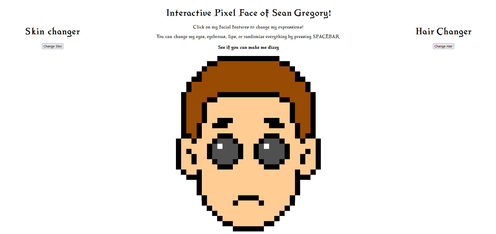
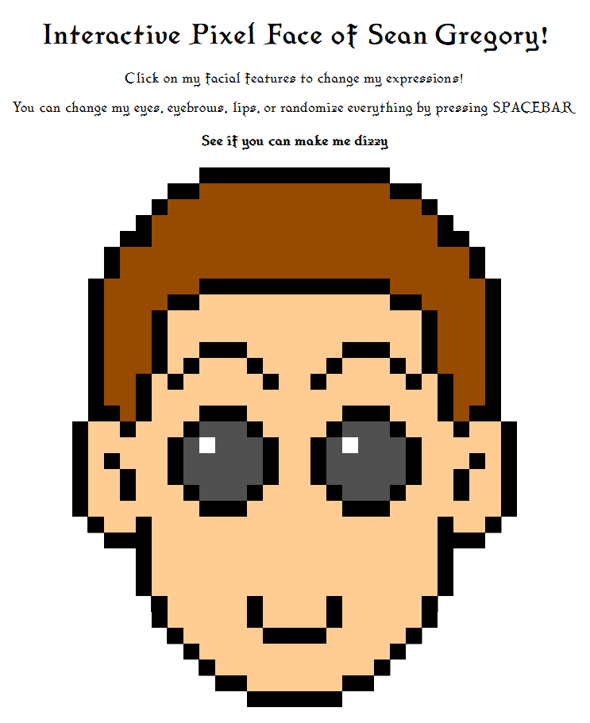
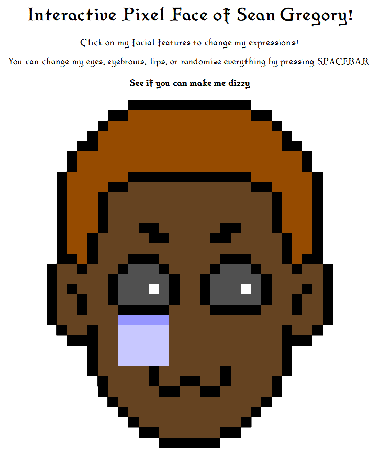
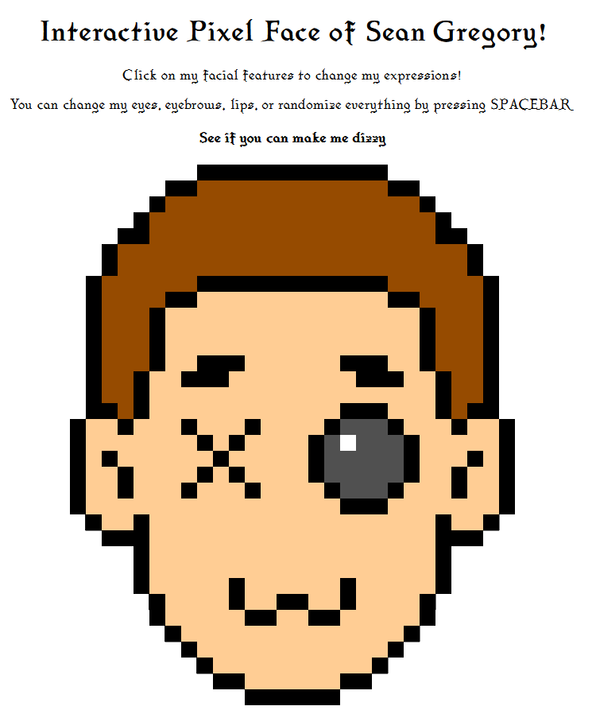

# SEAN'S INTERACTIVE PIXELATED FACE

BY: SEAN GREGORY

[Check it out!](https://seangregoryv8.github.io/cart253/assignments/art-jam/)

## Description

This shows a relatively basic rendition of my face, normal proportions... or so it seems.

The canvas has been personally customized from the ground up into a 20x20 grid format. This allowed for me to make pixel art of myself, something I always wanted to try and do. I got a reference guide online to help with the pixel art itself and translated it onto the canvas!

However, where this differs from a self portrait is in my implementation of a customized pseudo character creator!

As I grew up, I always liked the idea of creating my own avatar within a video game. When I got into SoulsBorne games, it became a dream to painstakingly craft my own persona into a video game and see myself within the screen!

With this project, I really wanted to capture that charm by not only letting you select my features, but making it all feel alive with additional features.

## Features

### Skin and Hair changers

>Whilst I'm unable to do this, my avatar is able to change his skin and hair colour to 10 pre-selected options. Just click on the button and customize to your hearts content!

### Eyebrow, Eye and Mouth changers

>Various types of models have been made by me, including over 5 independent mouth, eyebrow and eye models to be put onto my avatar. Go ahead and customize it to your hearts content, and see what kind of pose you can make me do!

### "Idle Animations"?

>Every few seconds, I'll change to a random emotion all by myself! Don't worry, I'm not hurt, I'm just demonstrating my various facial features!

### Don't blink!

>It's bad to not blink, you know. You'll seriously hurt yourself if you try to not blink. That includes both me and my avatar, so if you see me randomly blinking, don't worry, it's perfectly normal!

### All at the press of a spacebar

>Want to completely randomize everything? Just hit the spacebar and see what kind of funky pose I decide to hit!

### Eye tracking

>I can follow you around the screen! Don't worry, it's not creepy at all :D
  Just move your mouse around and watch me track your every move!

### *Secret feature*

>Y'know, all this tracking could really do a number on me. I am pretty motion sick in real life you know... Whatever you do, take the movements slow, and don't move around too fast. It could make me really upset...

## Screenshot(s)

## License

This bit should include the license you want to apply to your work. For example:

> This project is licensed under a Creative Commons Attribution ([CC BY 4.0](https://creativecommons.org/licenses/by/4.0/deed.en)) license with the exception of libraries and other components with their own licenses.